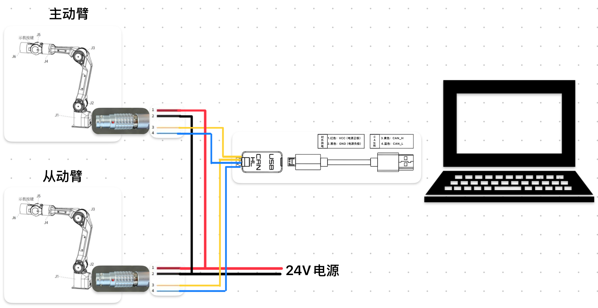

# Piper 机械臂sdk部分demo


Test:

|PYTHON |STATE|
|---|---|
|||

## 安装方法

### 安装依赖

```shell
pip3 install python-can
```

```shell
pip3 install piper_sdk
```

### 安装can工具

```shell
sudo apt update && sudo apt install can-utils ethtool
```

这两个工具用来配置can模块

如果执行bash脚本出现`ip: command not found`

请安装ip指令，一般是`sudo apt-get install iproute2`

## 快速使用

### 使能can模块

首先需要设置好shell脚本参数

#### 单条机械臂

##### pc只插入一个usb转can模块

- **此处使用`can_activate.sh`脚本**

直接执行

```bash
bash can_activate.sh can0 1000000
```

##### pc插入多个usb转can模块

- **此处使用`can_activate.sh`脚本**

拔掉所有can模块

只将连接到机械臂的can模块插入PC，执行

```shell
sudo ethtool -i can0 | grep bus
```

并记录下`bus-info`的数值例如`1-2:1.0`

ps:**一般第一个插入的can模块会默认是can0，如果没有查询到can可以使用`bash find_all_can_port.sh`来查看刚才usb地址对应的can名称**

假设上面的操作记录的`bus-info`数值为`1-2:1.0`

然后执行,查看can设备是否激活成功

```bash
bash can_activate.sh can_piper 1000000 "1-2:1.0"
```

ps:**此处的意思是，1-2:1.0硬件编码的usb端口插入的can设备，名字被重命名为can_piper，波特率为1000000，并激活**

然后执行`ifconfig`查看是否有`can_piper`，如果有则can模块设置成功

#### 想要同时激活多个can模块

- **此处使用`can_config.sh`脚本**

在`can_config.sh`中，`EXPECTED_CAN_COUNT`参数为想要激活的can模块数量,现在假设为2

然后can模块中的其中一个单独插入PC，执行

```shell
sudo ethtool -i can0 | grep bus
```

并记录下`bus-info`的数值例如`1-2:1.0`

接着插入下一个can模块，注意不可以与上次can模块插入的usb口相同，然后执行

```shell
sudo ethtool -i can1 | grep bus
```

ps:**一般第一个插入的can模块会默认是can0，第二个为can1，如果没有查询到can可以使用`bash find_all_can_port.sh`来查看刚才usb地址对应的can名称**

假设上面的操作记录的`bus-info`数值分别为`1-2:1.0`、`1-4:1.0`

则将下面的`USB_PORTS["1-9:1.0"]="can_left:1000000"`的中括号内部的双引号内部的参数换为`1-2:1.0`

另一个同理

`USB_PORTS["1-5:1.0"]="can_right:1000000"` -> `USB_PORTS["1-4:1.0"]="can_right:1000000"`

ps:**此处的意思是，1-2:1.0硬件编码的usb端口插入的can设备，名字被重命名为can_left，波特率为1000000，并激活**

然后执行`bash can_config.sh`,查看终端输出是否激活成功

然后执行`ifconfig`查看是不是有`can_left`和`can_right`，如果有则can模块设置成功

## demo说明

```shell
.
├── piper_disable.py        # 失能机械臂
├── piper_enable.py         # 使能机械臂
├── piper_joint_ctrl.py     # 机械臂关节控制
├── piper_master_config.py  # 将机械臂设置为主动臂
├── piper_slave_config.py   # 将机械臂设置为从动臂
└── read_joint_state.py     # 读取关节角消息并打印
```

注意：如果是在机械臂处于主动臂模式下，发送设置为从动臂指令后需要重新启动机械臂，机械臂才会切换到从动臂模式

## 使用双臂摇操作

### 硬件设置流程

- 示意图



1. 单独将其中一个机械臂设定为主动臂，另一条设定为从动臂(如上demo)，然后将两个机械臂下电
2. 将两个机械臂共同连接在一个can模块上，令主从臂的can连接
3. 先将从动臂上电，然后将主动臂上电，稍等几秒，即可进行遥操作
4. 如未成功，请查看can线是否连接正常，尝试重新断电上电

### 读取主从臂数据

详见SDK中interface说明，这里只作简要

#### 读取主动臂消息

`GetArmJointMsgs`、`GetArmGripperMsgs`这两个函数用来获取从动机械臂关节消息和夹爪消息(原始消息)

`GetArmJointCtrl`、`GetArmGripperCtrl`这两个函数用来获取主动机械臂关节消息和夹爪消息(原始消息)

#### 控制从臂

`MotionCtrl_2`用来设定控制指令模式，以关节模式举例

```python
# 0x01设定can指令控制模式；0x01设定关节控制模式；50设定机械臂运动速度
piper.MotionCtrl_2(0x01, 0x01, 50)
```

`JointCtrl`用来控制六个关节

`GripperCtrl`用来控制夹爪

注意！！！：**控制从臂的时候，需要将主臂和从臂断开，可以将主臂的航插拔掉，再执行控制从臂程序，否则就算执行了程序，由于主臂也一直在发送控制从臂指令，会出现从臂失控现象**
